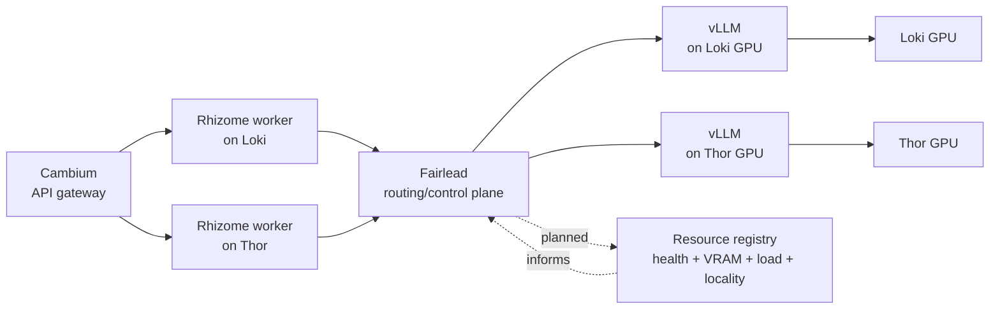

# Fairlead — Architecture and Implementation Guide

---

## The complete system

Five components, each owning a distinct layer:

```
User
  ↓  HTTPS
Verdant          React frontend — dashboard, chat, triage, tasks
  ↓  HTTPS /api/v1
Cambium          Go API gateway — auth, provider key management, SSE proxy
  ↓  HTTP /internal/agent (SSE)
Rhizome          Python LangGraph agent — 93 tools, planning, triage, DB
  ↓  HTTP /v1/chat/completions (OpenAI-compatible)
Fairlead         Rust compute router — inference, job dispatch, circuit breaking
  ↓  HTTP /v1
vLLM             Python model server — GPU inference on Loki
  OR
Cloud APIs       Gemini, Claude, OpenAI — fallback when local is unavailable
```

**Cambium** handles everything external-facing: verifies JWT tokens, decrypts the
user's stored API key, injects it into the Rhizome request. It knows about users
and sessions. It does not know about gardens.

**Rhizome** is the domain engine. It runs a LangGraph graph: session context →
weather → triage → LLM → tools → loop. It knows about plants, projects, tasks,
incidents. It does not know which GPU served its last LLM call.

**Fairlead** is a compute infrastructure layer. It receives OpenAI-compatible
requests and async job submissions. It knows about nodes, VRAM, circuit states,
and job queues. It does not know what a garden is.

**vLLM** serves the model. It knows about GPU memory, batching, and
PagedAttention. It knows nothing above itself.

---

## Mental model: vLLM vs Fairlead

Fairlead is not an inference runtime. It does not load model weights, run CUDA
kernels, implement attention, tokenize prompts, or produce tokens directly. It is
the request gateway and control-plane layer in front of inference runtimes.

vLLM is the data-plane inference server. A vLLM process owns:

- Loading model weights into GPU memory.
- Tokenization and request execution.
- KV cache management.
- Continuous batching.
- GPU kernel execution through CUDA/PyTorch.
- Streaming OpenAI-compatible responses.
- Tensor parallelism when configured.

Fairlead owns routing and operational policy around those inference servers. It
can decide:

- Which backend URL should receive a request.
- Whether a backend should be skipped because its circuit is open.
- Whether a thread should prefer the same backend for cache locality.
- Whether a request should be rejected, retried, or routed elsewhere.
- What metrics and traces should describe the routing decision.

That means Fairlead is a control-plane gateway, while vLLM is the model-serving
data plane:

```text
client or agent
  -> Fairlead decides where work should go
  -> vLLM runs the model on GPU
  -> Fairlead streams the response back
```

### GPU resource management

Fairlead does not manage GPU memory at the CUDA allocator level. vLLM and other
GPU workers manage their own memory internally. Fairlead's future role is
admission control: decide where work is allowed to go based on reported capacity,
health, priority, and current load.

There are three separate layers:

| Layer | Owner | Example responsibility |
|---|---|---|
| GPU execution | vLLM / CUDA / PyTorch | Load weights, allocate KV cache, run kernels |
| Process placement | k3s / Docker / systemd | Start, stop, restart, and place containers |
| Request admission | Fairlead | Pick backend, skip unhealthy nodes, avoid oversubscribed resources |

The planned VRAM accounting model is cooperative. GPU consumers register their
resource use with Fairlead, and Fairlead uses that control-plane view to avoid
sending new work to nodes without enough reported headroom.

Example:

```text
node: loki
  total_vram_mb: 24576
  registered_consumers:
    - vllm-llama: 18432 MB
    - vision-worker: 6144 MB
  schedulable_headroom: 0 MB
```

Fairlead does not infer this from CUDA directly in the current design. It relies
on workers and model servers reporting capacity, or on future node probes that
publish capacity into Fairlead's registry. This is why the resource registry is a
scheduler input, not the source of truth for GPU execution.

The current code implements only the gateway part: backend selection, circuit
breaking, health probing, soft affinity, streaming proxying, and basic metrics.
VRAM accounting, priority queues, worker registration, and async job dispatch are
planned later phases.

### Rhizome example: Loki and Thor

Assume a deployment with two GPU nodes:

- `loki`: runs a Rhizome worker and a local vLLM server.
- `thor`: runs a Rhizome worker and a local vLLM server.
- Fairlead can run as one shared service, or as a local sidecar per node. The
  routing policy is easiest to reason about as one logical Fairlead control
  plane.



The desired routing behavior is locality-aware and resource-aware:

```text
Rhizome request starts on Loki
  -> prefer vLLM on Loki, because same-node traffic should have lower latency
  -> if Loki vLLM is unhealthy, overloaded, or lacks reported GPU headroom,
     route to Thor vLLM
  -> if both local GPU backends are unavailable or full, either queue by priority
     or fall back to a cloud provider, depending on policy
```

The same applies in reverse for a Rhizome request that starts on Thor:

```text
Rhizome request starts on Thor
  -> prefer vLLM on Thor
  -> if Thor is unavailable or full, route to Loki
  -> if both are unavailable or full, queue or cloud fallback
```

To make this work, Fairlead needs more metadata than the current Phase 4 code
has:

- **Backend node identity:** each backend must know whether it lives on `loki`,
  `thor`, or another node.
- **Request origin identity:** Rhizome or the local Fairlead sidecar must provide
  where the request originated, for example `X-Fairlead-Origin-Node: loki`.
- **Resource state:** vLLM and other GPU consumers must report usable capacity,
  reserved VRAM, current load, or an equivalent schedulable signal.
- **Workload metadata:** chat completions, embeddings, vision jobs, and batch
  jobs may have different resource estimates and priority rules.
- **Queue policy:** realtime inference may fail fast or wait briefly; background
  jobs can queue longer and yield to realtime work.

With those inputs, the router can make a decision like:

```text
candidates = all backends serving the requested model/workload
candidates = remove backends with open circuits
candidates = remove backends without enough reported capacity
prefer backend on request origin node
then prefer existing session affinity
then prefer lower load / higher free capacity
if none eligible:
  queue, return 503, or fall back to cloud according to workload policy
```

Current Fairlead does not yet implement locality-aware or VRAM-aware routing. It
only walks the configured `BACKENDS` list, honors soft session affinity, and
skips backends whose circuit breakers are open. The Loki/Thor behavior above is
the intended Bluewater/Fairlead direction once backend pools, origin metadata,
resource accounting, and priority queues are added.

---

## What Fairlead does

Two distinct surfaces.

### Surface 1: Synchronous inference proxy

```
POST /v1/chat/completions   — receive, select backend, proxy, stream back
POST /v1/embeddings         — same pattern for embedding requests
GET  /v1/models             — list available backends
```

Every inference request goes through a decision pipeline:

```
request arrives
  → check priority (realtime / batch / background)
  → find eligible backends (circuit closed + VRAM headroom)
  → check session affinity (prefer same node for KV cache)
  → proxy to selected backend, stream response back
  → if backend fails: try next in fallback chain
  → if all local fail: try cloud providers
```

### Surface 2: Async job dispatch

```
POST /v1/jobs        — submit, get job_id immediately
GET  /v1/jobs/{id}   — poll status
```

```
job submitted
  → queued by priority (realtime > batch > background)
  → scheduler selects a registered worker with matching job type + VRAM headroom
  → worker processes async
  → callback fires to caller on completion
```

**Job types:**
- `vision_analysis` — route to vision MCP sidecar on Loki GPU
- `embed_batch` — batch embedding generation
- `index_build` — pgvector or FAISS index construction
- `cluster` — k-means or HDBSCAN over an embedding space

**Supporting infrastructure:**
- `POST /v1/workers/register` — workers announce capabilities and VRAM cost
- `POST /v1/vram/register` — GPU consumers report allocation
- `GET /metrics` — Prometheus: queue depth, circuit states, VRAM per node

---

## The priority queue model

The core scheduling guarantee:

| Priority | Who uses it | What it means |
|---|---|---|
| `realtime` | Chat completions, query-time embeddings | A user is waiting. Schedule first, always. |
| `batch` | Vision jobs, async embeddings | User submitted and moved on. Schedule when no realtime demand. |
| `background` | Index builds, clustering, KB ingestion | No user waiting. Only run when the GPU has nothing more important to do. |

A background index rebuild that started at midnight will not slow down a user's
chat response at 9am. This is enforced structurally, not by policy.

---

## The 7-phase build plan

| Phase | What you build | What it unlocks |
|---|---|---|
| 1 | Axum server, /health, config, tracing | Something that runs |
| 2 | OpenAI proxy, single backend, streaming | Rhizome can call Fairlead instead of cloud |
| 3 | Circuit breaker, health checks, basic /metrics | Automatic failover when vLLM crashes |
| 4 | Fallback chain, session affinity, cloud providers | Full resilience across local + cloud |
| 5 | VRAM accounting, priority queue | Vision sidecar coexists without OOM; background work yields to users |
| 6 | Async job API, worker registration, callbacks | Vision and embedding jobs go through Fairlead |
| 7 | Index/cluster job types, FAISS/GPU, full metrics | Advanced RAG indexing, complete observability |

Phases 1–3 give you a working proxy in a few days. Phases 4–5 give you
production resilience. Phases 6–7 complete the async compute platform.

---

## How Rust defines the architecture

Rust's design forces certain architectural decisions that you can't avoid — but
they are the right decisions. Understanding them before writing the first line
prevents a lot of friction.

### 1. Ownership drives shared state design

In Python you write:
```python
backends = {}  # anyone can read/write
```

Rust won't compile that across threads. Every piece of shared mutable state must
be explicit:
```rust
// Arc = shared ownership across threads
// RwLock = many readers OR one writer at a time
type BackendMap = Arc<RwLock<HashMap<String, BackendState>>>;
```

This isn't ceremony — it's the architecture. When you write `Arc<RwLock<...>>`
you're making a deliberate decision: "this data will be read by many concurrent
request handlers and occasionally written by background health check tasks."
The type encodes the concurrency pattern.

Fairlead's shared state objects, each `Arc`-wrapped and cloned into each handler
and background task:
- `Arc<RwLock<BackendMap>>` — backend states and circuit breakers
- `Arc<RwLock<VramRegistry>>` — VRAM accounting per node
- `Arc<RwLock<AffinityMap>>` — thread_id → preferred backend
- `Arc<RwLock<WorkerRegistry>>` — registered job workers

### 2. The async model requires structure, not just `async fn`

Tokio is cooperative multitasking. A task runs until it hits an `.await` point,
then yields. Blocking work between `.await` points — a long computation, a
`std::thread::sleep`, synchronous file I/O — freezes the entire thread, which in
Tokio may be serving hundreds of concurrent requests.

This forces a clear architecture split.

**Async path** — request handlers, forwarding, queue checks:
```rust
async fn handle_chat_completions(/* ... */) -> Response {
    let backend = router.select_backend().await;   // async: checks circuit state
    let response = client.post(&backend.url)
        .send().await?;                            // async: network I/O
    Body::from_stream(response.bytes_stream())     // async: stream back
}
```

**Background tasks** — health checks, job scheduler, metrics:
```rust
// Spawned once at startup, run forever
tokio::spawn(async move {
    let mut interval = tokio::time::interval(Duration::from_secs(10));
    loop {
        interval.tick().await;
        probe_backend(&url, &circuit).await;
    }
});
```

The server will have a handful of long-lived background tasks (one per backend
for health checking, one for the job scheduler) and thousands of short-lived
request handler tasks. They all share the `Arc`-wrapped state through clones.

### 3. The type system makes state machines correct

The circuit breaker has three states. In Python you'd use a string. In Rust:

```rust
enum CircuitState {
    Closed,
    Open { until: std::time::Instant },
    HalfOpen,
}
```

Every `match` on this enum must handle all three cases. The compiler will not let
you forget `HalfOpen`. This matters for a circuit breaker because the half-open
state (one probe request to test recovery) is the subtle one — it's exactly what
you'd accidentally skip in a string-based approach.

The same applies to job status, backend health, and priority levels. Everything
with a finite set of states becomes an enum. Exhaustiveness is enforced.

### 4. Channels replace shared queues

The idiomatic Rust approach to the priority queue is Tokio channels — one per
priority level — rather than a shared data structure with a lock:

```rust
let (realtime_tx, mut realtime_rx) = mpsc::channel::<Job>(256);
let (batch_tx,    mut batch_rx)    = mpsc::channel::<Job>(256);
let (bg_tx,       mut bg_rx)       = mpsc::channel::<Job>(256);
```

The `biased` `select!` enforces priority:
```rust
loop {
    tokio::select! {
        biased;   // evaluate branches in declared order, not randomly
        Some(job) = realtime_rx.recv() => dispatch(job).await,
        Some(job) = batch_rx.recv(),
            if realtime_rx.is_empty() => dispatch(job).await,
        Some(job) = bg_rx.recv(),
            if realtime_rx.is_empty() && batch_rx.is_empty() => dispatch(job).await,
    }
}
```

Without `biased`, Tokio randomizes which ready branch is selected to prevent
starvation. With it, you get strict priority. The queue depth of each channel
is directly observable for Prometheus metrics.

### 5. Send + Sync are the concurrency contract

Rust's trait system expresses thread safety. Any value that needs to cross thread
boundaries must implement `Send`. Any value that can be safely shared by reference
across threads must implement `Sync`.

Tokio requires `Send + 'static` on everything spawned as a task. When you
`tokio::spawn` a health check task that closes over the backend state, Rust
verifies at compile time that the backend state is safe to send across threads.
If it isn't, you get a clear compile error — not a race condition at runtime
six months later.

`Arc<RwLock<T>>` is both `Send` and `Sync` when `T: Send + Sync`. The `Arc`
handles shared ownership; the `RwLock` handles mutation safety; the compiler
verifies the combination is sound.

### 6. Zero-cost abstractions mean the architecture mirrors performance

Rust's abstractions compile to the same machine code as hand-written code.
Generics (static dispatch) have zero overhead; `Box<dyn Trait>` (dynamic
dispatch) has a small indirection cost.

On the hot path (every inference request): use generics. The circuit breaker
check and VRAM query happen for every request — the compiler inlines them.

For the job dispatcher (not hot): trait objects are fine. The flexibility of
dispatching to different worker types at runtime matters more than the
nanoseconds.

---

## The mental model

Fairlead is a tree of async tasks sharing Arc-wrapped state through explicit
synchronized wrappers. A handful of long-lived background tasks — health
checkers, job scheduler, metrics collector — run forever alongside thousands
of short-lived request handler tasks. They communicate through channels, not
shared memory. The type system enforces that all state transitions are
exhaustive. The borrow checker enforces that nothing is mutated unsafely.
The async runtime ensures nothing blocks. The result is a system that is
concurrent by default, thread-safe by construction, and whose performance
characteristics are predictable because nothing is hiding behind a garbage
collector.
