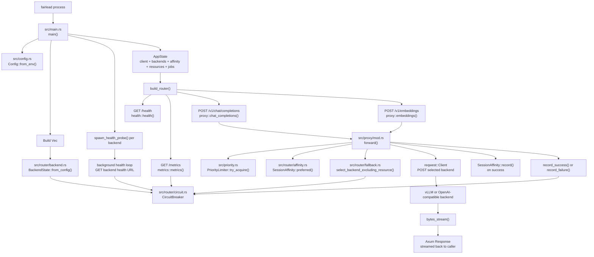

# Code Walkthrough

This document explains the current Rust code from process startup to proxied
response. It assumes familiarity with allocation and deallocation, pointers or
references, mutable shared state, and request/response services, but not much
Rust.

Fairlead is currently one Rust binary. Its current behavior is:

```text
start process
  -> read environment config
  -> build shared backend state
  -> start background health probes
  -> register HTTP routes
  -> accept requests
  -> check priority admission
  -> pick an available backend
  -> proxy the request to that backend
  -> stream the response back
```

## Code Architecture Diagram

This diagram shows how the current Rust modules and main functions connect.



Important shared state:

- `CircuitBreaker` is shared by request handlers, health probes, and metrics.
- `SessionAffinity` is shared by request handlers.
- `PriorityLimiter` is shared by request handlers so concurrent requests compete
  for the same per-priority admission slots.
- `AppState` is cloned into handlers, but its interior circuit breakers and
  shared maps/limiters still point at shared allocations.

## Rust Concepts Used Here

### Crates

A **crate** is Rust's unit of compilation and packaging. In this repo, Fairlead
is one binary crate: compiling the project produces one executable server.

Fairlead also depends on library crates listed in `Cargo.toml`, including:

- `axum` for the HTTP server framework.
- `tokio` for the async runtime.
- `reqwest` for outbound HTTP requests.
- `serde` and `serde_json` for JSON types.

When code starts with a path like `axum::...`, it is referring to something
exported by the external `axum` crate. When code starts with `crate::...`, it is
referring to something inside the current Fairlead crate.

### Modules

At the top of `src/main.rs`:

```rust
mod config;
mod error;
mod health;
mod jobs;
mod metrics;
mod models;
mod priority;
mod proxy;
mod resources;
mod router;
mod scheduler;
mod workers;
```

These lines tell the Rust compiler to compile files or directories with those
names:

- `mod config;` loads `src/config.rs`.
- `mod jobs;` loads `src/jobs.rs`.
- `mod priority;` loads `src/priority.rs`.
- `mod proxy;` loads `src/proxy/mod.rs`.
- `mod resources;` loads `src/resources.rs`.
- `mod router;` loads `src/router/mod.rs`.
- `mod scheduler;` loads `src/scheduler.rs`.
- `mod workers;` loads `src/workers.rs`.

This is closer to declaring compilation units than to copying source text into
the current file. The compiler still understands these modules as part of one
crate.

### `use`

Rust code often refers to items through paths separated by `::`.

For example:

```rust
axum::routing::get
```

means: start at the external `axum` crate, go into its `routing` module, and use
the `get` function.

`use` lets the rest of the current module use a shorter local name for an item
from one of those paths.

```rust
use axum::{
    routing::{delete, get, post},
    Router,
};
```

This imports four Axum items into `src/main.rs`:

- `delete`, from `axum::routing::delete`.
- `get`, from `axum::routing::get`.
- `post`, from `axum::routing::post`.
- `Router`, from `axum::Router`.

Without the `use`, the code could still refer to the same items by their full
paths every time:

```rust
let app = axum::Router::new()
    .route("/health", axum::routing::get(health::health))
    .route("/v1/chat/completions", axum::routing::post(proxy::chat_completions));
```

With the `use`, the shorter names are available:

```rust
let app = Router::new()
    .route("/health", get(health::health))
    .route("/v1/chat/completions", post(proxy::chat_completions));
```

The Rust-specific point is that `use` is about name resolution, not loading or
copying code. The Axum code is compiled as the `axum` crate. Fairlead imports
selected names from that crate's module tree so the current module can refer to
them directly.

### `Result`

Many Rust functions return `Result<T, E>`:

```rust
async fn main() -> anyhow::Result<()>
```

That means the function either returns success value `()` or an error. `()` is
Rust's unit value: a real value that carries no information.

The `?` operator means: if this expression is an error, return that error from
the current function immediately; otherwise unwrap the success value.

```rust
let cfg = config::Config::from_env()?;
```

### Ownership, Allocation, and Cloning

Rust values usually have one owner. When that owner goes out of scope, the value
is dropped and any owned heap allocations are released. This is deterministic
cleanup without a garbage collector.

Passing a value by value usually moves ownership. After a move, the previous
binding cannot be used. Borrowing with `&value` gives another function temporary
access without transferring ownership.

If a value needs to be shared across many async request handlers, Fairlead uses
`Arc` and `RwLock`.

- `Arc<T>` is an atomically reference-counted pointer.
- `RwLock<T>` allows many readers or one writer.
- `Arc<RwLock<T>>` means shared mutable state with runtime locking.

This is the central pattern for circuit breakers and affinity maps.

Cloning means different things depending on the type:

- Cloning a `String` allocates/copies string data.
- Cloning an `Arc<T>` increments a reference count and gives another handle to
  the same allocation.
- Cloning `BackendState` is cheap because its circuit breaker is inside an
  `Arc`.

So `clone()` is not automatically "deep copy everything." You need to know the
type being cloned.

### Shared State

Shared state means multiple independently running parts of the program can
observe or update the same underlying value.

In Fairlead, the important shared-state objects are:

- Each backend's `CircuitBreaker`.
- The global `SessionAffinity` map.
- The `ResourceRegistry` of reported VRAM/load snapshots.
- The `PriorityLimiter` admission buckets.
- The in-process `RoutingMetrics` counters and summaries.

These must be shared because the server has many concurrent activities:

- Request handler A may notice `backend[0]` returned HTTP 500.
- Request handler B may arrive milliseconds later and need to know whether
  `backend[0]` is still available.
- A background health probe may independently discover that `backend[0]`
  recovered.
- Another request handler may update the affinity map after routing
  `thread-123` to `backend[1]`.

If every handler had its own private copy of the circuit breaker, failures
recorded in one request would be invisible to every other request. The router
would keep sending traffic to a broken backend because each handler would see
its own fresh state.

Fairlead avoids that with `Arc<RwLock<T>>`.

```text
                      Arc handle in request A
                    /
shared allocation: RwLock<CircuitBreaker>
                    \
                      Arc handle in health probe
```

All handles point to the same allocation. The reference count tracks how many
handles still exist. When the last `Arc` handle is dropped, the shared allocation
is deallocated.

The `RwLock` protects the value inside that allocation:

- `read().await` gives temporary read access. Many readers may coexist.
- `write().await` gives temporary mutable access. Only one writer may exist.
- The lock guard releases automatically when it goes out of scope.

So this line:

```rust
backend.circuit.write().await.record_failure();
```

means:

```text
wait until exclusive access to the circuit breaker is available
get mutable access
record one failure
release the lock when the guard is dropped
```

This is similar to a mutex-protected shared pointer, but with reader/writer lock
semantics and compiler-enforced ownership around the handles.

`AppState` itself is cloned into request handlers, but the important interior
state remains shared:

```rust
pub struct AppState {
    pub client: reqwest::Client,
    pub backends: Vec<BackendState>,
    pub affinity: SessionAffinity,
    pub metrics: RoutingMetrics,
    pub resources: ResourceRegistry,
    pub resource_policy: ResourceRoutingPolicy,
    pub priority_limiter: PriorityLimiter,
    pub jobs: JobRegistry,
    pub workers: WorkerRegistry,
}
```

Cloning `AppState` does not create independent circuit breakers or independent
affinity maps. `BackendState` contains an `Arc<RwLock<CircuitBreaker>>`, and
`SessionAffinity` contains an `Arc<RwLock<HashMap<...>>>`, so cloned handlers
still coordinate through the same underlying state. `PriorityLimiter` also
contains shared semaphore state, so cloned handlers compete for the same
realtime, batch, and background admission capacity.

### Tokio

Tokio is the async runtime Fairlead runs on.

Rust's `async` syntax describes work that can pause and resume, but the language
itself does not decide how those paused tasks are scheduled, how timers fire, or
how sockets wake tasks up when data arrives. Tokio provides that machinery.

In Fairlead, Tokio is responsible for:

- Starting the async `main` function through `#[tokio::main]`.
- Running many request handlers concurrently.
- Running background health-probe tasks created with `tokio::spawn`.
- Providing async TCP sockets through `tokio::net::TcpListener`.
- Providing async timers through `tokio::time::interval`.
- Providing async locks through `tokio::sync::RwLock`.

The rough mental model is:

```text
Tokio runtime
  -> watches sockets, timers, and async locks
  -> runs tasks until they hit .await
  -> parks tasks that are waiting
  -> wakes tasks when their I/O, timer, or lock is ready
```

This is why Fairlead can have many requests in flight while also running health
checks. A request waiting for a backend HTTP response does not block the entire
process. It yields at `.await`, and Tokio runs other ready tasks.

Tokio tasks are lightweight async tasks, not operating-system processes. They
are closer to scheduled coroutines managed by the runtime. When Fairlead calls:

```rust
tokio::spawn(async move {
    // health probe loop
});
```

it asks Tokio to run that async block concurrently with the HTTP server and
other request handlers.

### `async` and `.await`

An `async fn` can pause at `.await` points while waiting for I/O, timers, or
locks. Tokio is the runtime that polls and resumes these async tasks.

Examples:

```rust
tokio::net::TcpListener::bind(addr).await?;
backend.circuit.write().await.record_failure();
client.post(&url).send().await
```

These are places where the current task may yield so other tasks can run.

## Startup Path

The program starts in `src/main.rs`.

### 1. Declare Modules

```rust
mod config;
mod error;
mod health;
mod jobs;
mod metrics;
mod models;
mod priority;
mod proxy;
mod resources;
mod router;
mod scheduler;
mod workers;
```

These make the rest of the source tree available to `main.rs`.

### 2. Define Shared Application State

```rust
#[derive(Clone)]
pub struct AppState {
    pub client: reqwest::Client,
    pub backends: Vec<BackendState>,
    pub affinity: SessionAffinity,
    pub metrics: RoutingMetrics,
    pub resources: ResourceRegistry,
    pub resource_policy: ResourceRoutingPolicy,
    pub priority_limiter: PriorityLimiter,
}
```

`AppState` is the state every HTTP handler needs.

- `client` is the reusable outbound HTTP client.
- `backends` is the ordered list of backend runtime states: URL, stable backend
  ID, optional node ID, pool, supported workloads, and circuit breaker.
- `affinity` maps workload-scoped thread IDs to preferred backend indexes.
- `metrics` stores in-process request/retry/fallback aggregates.
- `resources` stores cooperative VRAM/load reports.
- `resource_policy` controls whether resource-aware eligibility is active.
- `priority_limiter` stores per-priority synchronous admission limits.
- `jobs` stores first-slice in-memory async job records.
- `workers` stores worker registration, heartbeat, stale status, and capacity
  accounting.

`#[derive(Clone)]` asks Rust to generate a `clone()` implementation. Axum clones
state handles into request handlers. This is cheap here because the expensive
shared parts are internally reference-counted.

### 3. Start Tokio Runtime and Enter `main`

```rust
#[tokio::main]
async fn main() -> anyhow::Result<()> {
```

The `#[tokio::main]` attribute generates normal synchronous startup code that
creates a Tokio runtime, then runs this async `main` inside it.

### 4. Read Configuration

```rust
let cfg = config::Config::from_env()?;
```

This calls `Config::from_env()` in `src/config.rs`. That function reads
environment variables:

- `PORT`
- `LOG_LEVEL`
- `LOG_FORMAT`
- `BACKENDS`
- `BACKENDS_JSON`
- `POOLS_JSON`
- `WORKLOAD_POOLS_JSON`
- `CIRCUIT_FAILURE_THRESHOLD`
- `CIRCUIT_COOLDOWN_SECS`
- `HEALTH_PROBE_INTERVAL_SECS`
- `RESOURCE_REPORT_TTL_SECS`
- `RESOURCE_AWARE_ROUTING`
- `CHAT_COMPLETIONS_REQUIRED_VRAM_MB`
- `EMBEDDINGS_REQUIRED_VRAM_MB`
- `PRIORITY_REALTIME_LIMIT`
- `PRIORITY_BATCH_LIMIT`
- `PRIORITY_BACKGROUND_LIMIT`

`BACKENDS` is parsed as a comma-separated list:

```text
http://spark-a:8000/v1,http://spark-b:8000/v1
```

`BACKENDS_JSON` is the richer configuration path. It can describe stable backend
IDs, node IDs, pools, supported workloads, and optional health probe paths:

```json
[
  {
    "id": "spark-a-vllm",
    "url": "http://spark-a:8000/v1",
    "node_id": "spark-a",
    "pool": "local-llm",
    "workloads": ["chat_completions", "embeddings"],
    "health_path": "/v1/models"
  }
]
```

If parsing fails, `?` returns the error and the process exits.

Phase 7A adds explicit placement policy config:

```json
["local-llm", "peer-llm", {"id": "vision"}]
```

That is the shape of `POOLS_JSON`. `WORKLOAD_POOLS_JSON` maps workload names to
eligible pools:

```json
{
  "chat_completions": ["local-llm", "peer-llm"],
  "vision_analysis": ["vision"]
}
```

Phase 7B applies this policy to synchronous chat and embedding dispatch. A
backend must support the requested workload and sit in one of that workload's
allowed pools before resource ranking, locality, affinity, or retry fallback can
select it. The pool list is ordered, so Fairlead tries earlier pools before
later pools; inside each pool it still uses origin locality, affinity, resource
rank, circuit state, and configured backend order. If the pool list is omitted,
Fairlead derives pools from backend metadata and keeps the `default` pool for
compatibility with simple `BACKENDS` setup. If a workload is omitted from an
explicit `WORKLOAD_POOLS_JSON`, it remains permissive by default.
`STRICT_WORKLOAD_POOLS=true` changes startup validation so explicit workload
policy must include every known workload.

Phase 7C applies the same policy to async worker placement. Worker registration
accepts pool metadata, scheduler preview only pairs jobs with workers whose pool
is allowed by the job type, and worker-pull claims only lease eligible queued
jobs for the claiming worker's pool.

Phase 7D adds optional strict worker pool validation. With the default
permissive setting, worker registration accepts any non-empty pool string. With
`STRICT_WORKER_POOLS=true`, the registration handler checks the worker's pool
against configured or derived `POOLS_JSON` before inserting it into the worker
registry.

### 5. Initialize Tracing

```rust
init_tracing(&cfg);
```

This configures logging. The `&cfg` syntax is a borrowed reference. It lets
`init_tracing` read the config without taking ownership of it. After this call,
`main` still owns `cfg` and can keep using it.

### 6. Create the Outbound HTTP Client

```rust
let client = reqwest::Client::new();
```

`reqwest::Client` is Fairlead's reusable client for sending requests to backend
model servers. It is analogous to a reusable HTTP connection manager.

### 7. Build Backend State Objects

```rust
let backends: Vec<BackendState> = cfg
    .backends
    .iter()
    .map(|backend| {
        BackendState::from_config(
            backend.clone(),
            cfg.circuit_failure_threshold,
            Duration::from_secs(cfg.circuit_cooldown_secs),
        )
    })
    .collect();
```

This transforms each parsed `BackendConfig` into a runtime `BackendState`. In
language-agnostic pseudocode:

```text
backends = new empty growable list
for each backend config reference in cfg.backends:
    copied_config = clone backend config
    cooldown = duration_from_seconds(cfg.circuit_cooldown_secs)
    backend = BackendState.from_config(
        copied_config,
        cfg.circuit_failure_threshold,
        cooldown
    )
    append backend to backends
```

`BackendState::from_config` creates:

```rust
pub struct BackendState {
    pub id: String,
    pub url: String,
    pub node_id: Option<String>,
    pub pool: String,
    pub workloads: Vec<WorkloadKind>,
    pub health_url: String,
    pub circuit: Arc<RwLock<CircuitBreaker>>,
}
```

Each backend has its own circuit breaker and health probe URL. For an
OpenAI-compatible backend with base URL `http://node-a:8000/v1`, the default
health URL is `http://node-a:8000/v1/models`. If a backend exposes a different
endpoint, `BACKENDS_JSON` can provide `health_path`, such as `/health`.

The `backend.clone()` call copies the parsed backend metadata because each
`BackendState` owns its runtime copy. The circuit breaker is allocated inside
`BackendState::from_config` and wrapped in `Arc<RwLock<_>>` so request handlers
and health probes can share it.

### 8. Spawn Background Health Probes

```rust
for b in &backends {
    spawn_health_probe(
        b.circuit.clone(),
        b.health_url.clone(),
        client.clone(),
        Duration::from_secs(cfg.health_probe_interval_secs),
    );
}
```

`for b in &backends` borrows the backend list. It does not move the backends.

For each backend, Fairlead starts a background Tokio task. The task periodically
sends `GET` to the backend health URL. If the request reaches the backend and
gets an HTTP response, it records circuit success. If it fails to connect, it
records circuit failure.

The important part is that `b.circuit.clone()` clones the `Arc`, not the circuit
breaker itself. The health probe and request handlers share the same circuit
state. When the health probe records a failure, the request path can immediately
see that same failure count and circuit state.

### 9. Build `AppState`

```rust
let state = AppState {
    client,
    backends,
    affinity: SessionAffinity::default(),
    metrics: RoutingMetrics::default(),
    resources: ResourceRegistry::new(Duration::from_secs(cfg.resource_report_ttl_secs)),
    resource_policy: ResourceRoutingPolicy {
        enabled: cfg.resource_aware_routing,
        chat_completions_required_vram_mb: cfg.chat_completions_required_vram_mb,
        embeddings_required_vram_mb: cfg.embeddings_required_vram_mb,
    },
    priority_limiter: PriorityLimiter::new(
        cfg.priority_realtime_limit,
        cfg.priority_batch_limit,
        cfg.priority_background_limit,
    ),
    jobs: JobRegistry::default(),
};
```

This packages the HTTP client, backend list, empty affinity map, metrics,
resource registry, resource policy, priority limiter, and in-memory job registry
into one value that Axum can pass to handlers.

### 10. Build the HTTP Router

```rust
let app = build_router(state);
```

`build_router` registers HTTP routes:

```rust
Router::new()
    .route("/health", get(health::health))
    .route("/metrics", get(metrics::metrics))
    .route("/v1/models", get(models::list_models))
    .route("/v1/resources", get(resources::list_resources))
    .route("/v1/resources/report", post(resources::report_resources))
    .route("/v1/jobs", get(jobs::list_jobs).post(jobs::submit_job))
    .route("/v1/jobs/prune", post(jobs::prune_jobs))
    .route("/v1/jobs/:id", get(jobs::get_job).delete(jobs::cancel_job))
    .route("/v1/scheduler/preview", get(scheduler::preview_next_assignment_handler))
    .route("/v1/workers", get(workers::list_workers))
    .route("/v1/workers/register", post(workers::register_worker))
    .route("/v1/workers/:id", delete(workers::deregister_worker))
    .route("/v1/workers/:id/drain", post(workers::drain_worker))
    .route("/v1/workers/:id/reactivate", post(workers::reactivate_worker))
    .route("/v1/workers/:id/claim", post(scheduler::claim_worker_job_handler))
    .route(
        "/v1/workers/:worker_id/jobs/:job_id/renew",
        post(scheduler::renew_worker_job_lease_handler),
    )
    .route(
        "/v1/workers/:worker_id/jobs/:job_id/complete",
        post(scheduler::complete_worker_job_handler),
    )
    .route(
        "/v1/workers/:worker_id/jobs/:job_id/fail",
        post(scheduler::fail_worker_job_handler),
    )
    .route("/v1/workers/:id/heartbeat", post(workers::heartbeat_worker))
    .route("/v1/chat/completions", post(proxy::chat_completions))
    .route("/v1/embeddings", post(proxy::embeddings))
    .with_state(state)
```

This means:

- `GET /health` calls `health::health`.
- `GET /metrics` calls `metrics::metrics`.
- `GET /v1/models` calls `models::list_models`.
- `GET /v1/resources` calls `resources::list_resources`.
- `POST /v1/resources/report` calls `resources::report_resources`.
- `POST /v1/jobs` calls `jobs::submit_job`.
- `GET /v1/jobs` calls `jobs::list_jobs`.
- `POST /v1/jobs/prune` calls `jobs::prune_jobs`.
- `GET /v1/jobs/{id}` calls `jobs::get_job`.
- `DELETE /v1/jobs/{id}` calls `jobs::cancel_job`.
- `GET /v1/scheduler/preview` calls
  `scheduler::preview_next_assignment_handler`.
- `GET /v1/workers` calls `workers::list_workers`.
- `POST /v1/workers/register` calls `workers::register_worker`.
- `DELETE /v1/workers/{id}` calls `workers::deregister_worker`.
- `POST /v1/workers/{id}/drain` calls `workers::drain_worker`.
- `POST /v1/workers/{id}/reactivate` calls `workers::reactivate_worker`.
- `POST /v1/workers/{id}/claim` calls `scheduler::claim_worker_job_handler`.
- `POST /v1/workers/{worker_id}/jobs/{job_id}/renew` calls
  `scheduler::renew_worker_job_lease_handler`.
- `POST /v1/workers/{worker_id}/jobs/{job_id}/complete` calls
  `scheduler::complete_worker_job_handler`.
- `POST /v1/workers/{worker_id}/jobs/{job_id}/fail` calls
  `scheduler::fail_worker_job_handler`.
- `POST /v1/workers/{id}/heartbeat` calls `workers::heartbeat_worker`.
- `POST /v1/chat/completions` calls `proxy::chat_completions`.
- `POST /v1/embeddings` calls `proxy::embeddings`.

### 11. Bind a TCP Listener

```rust
let addr: SocketAddr = format!("0.0.0.0:{}", cfg.port).parse()?;
let listener = tokio::net::TcpListener::bind(addr).await?;
```

This builds a listen address from the port and binds a TCP socket.

### 12. Serve Forever

```rust
axum::serve(listener, app).await?;
```

This starts accepting HTTP connections. In normal operation this line does not
return until the server shuts down or hits a fatal error.

## Request Path

Assume a client sends:

```text
POST /v1/chat/completions
X-Fairlead-Thread-Id: thread-123

{... OpenAI-compatible JSON ...}
```

### 1. Axum Calls the Route Handler

Because `build_router` registered:

```rust
.route("/v1/chat/completions", post(proxy::chat_completions))
```

Axum calls:

```rust
pub async fn chat_completions(
    State(state): State<AppState>,
    headers: HeaderMap,
    body: Bytes,
) -> Response {
    forward(
        &state,
        WorkloadKind::ChatCompletions,
        "chat/completions",
        &headers,
        body,
    )
    .await
}
```

The parameters are Axum extractors:

- `State(state)` extracts a clone of `AppState`.
- `headers` contains request headers.
- `body` contains raw request bytes.

The function immediately calls `forward`.

`POST /v1/embeddings` works the same way, except it passes
`WorkloadKind::Embeddings` and `"embeddings"`.

### 2. Parse Priority

```rust
let priority = match parse_priority(headers) {
    Ok(priority) => priority,
    Err(message) => return (StatusCode::BAD_REQUEST, message).into_response(),
};
```

`parse_priority` reads `X-Fairlead-Priority`. Missing priority defaults to
`realtime`. Unknown values return HTTP 400 before any backend is selected.

### 3. Extract Optional Routing Headers

```rust
let thread_id = headers
    .get("x-fairlead-thread-id")
    .and_then(|v| v.to_str().ok())
    .map(str::to_owned);

let origin_node = headers
    .get("x-fairlead-origin-node")
    .and_then(|v| v.to_str().ok())
    .map(str::to_owned);
```

This tries to read:

- `X-Fairlead-Thread-Id`, used for soft session affinity.
- `X-Fairlead-Origin-Node`, used for same-node locality.

The return type is `Option<String>`:

- `Some("thread-123")` if the header exists and is valid text.
- `None` if it is missing or invalid.

`Option<T>` is Rust's explicit nullable value. It is like a pointer that must be
checked before use, except the compiler forces the check before the inner value
can be accessed.

### 4. Reject if No Backends Are Configured

```rust
if state.backends.is_empty() {
    return (StatusCode::SERVICE_UNAVAILABLE, "no backends configured").into_response();
}
```

If `BACKENDS` was empty, there is nowhere to send the request. Fairlead returns
HTTP 503.

### 5. Acquire Priority Admission

```rust
let Some(priority_permit) = state.priority_limiter.try_acquire(priority) else {
    return (StatusCode::TOO_MANY_REQUESTS, "priority limit reached").into_response();
};
```

`PriorityLimiter` owns one Tokio semaphore per priority level: `realtime`,
`batch`, and `background`. `try_acquire` is non-blocking:

- If the bucket has capacity, it returns a `PriorityPermit`.
- If the bucket is full, it returns `None` and Fairlead returns HTTP 429.

The permit is intentionally stored as a value. In Rust, a value is dropped when
its owner goes away. Dropping the permit releases the semaphore slot and
decrements the in-flight metric.

For a successful upstream response, Fairlead moves the permit into the streamed
response body wrapper. That keeps the priority slot occupied until the caller
finishes or drops the response body, not merely until upstream response headers
arrive.

This is admission control, not a queue. Fairlead does not currently wait for
priority capacity on synchronous proxy requests.

### 6. Look Up Preferred Backend

```rust
let affinity_key = thread_id
    .as_deref()
    .map(|tid| affinity_key(workload_kind, tid));

let preferred = match affinity_key {
    Some(ref key) => state.affinity.preferred(key).await,
    None => None,
};
```

If the request has a thread ID, Fairlead asks the affinity map whether that
thread already has a preferred backend index for this workload. The public header
is still `X-Fairlead-Thread-Id`, but the stored key is scoped, for example
`chat_completions:abc` or `embeddings:abc`.

The `ref` means "borrow the string inside `Some` rather than moving it." We still
need `affinity_key` later when recording affinity.

### 7. Build Resource Selection State

```rust
let resource_state = resource_selection_state(state, &workload_kind).await;
```

If `RESOURCE_AWARE_ROUTING=false`, this returns an empty selection state and the
router behaves like the circuit/locality/affinity proxy. If it is enabled,
Fairlead checks each backend for:

- a configured `node_id`
- a fresh backend-level or node-level resource report
- enough available VRAM for the workload estimate

Backends without fresh capacity are marked ineligible. Eligible backends get a
rank containing current load and available VRAM.

### 8. Select a Backend

```rust
let mut attempted = Vec::new();
let mut next_backend = None;

loop {
    let idx = match next_backend.take() {
        Some(idx) => idx,
        None => {
            let Some(idx) = select_backend_excluding_resource(
                &state.backends,
                preferred,
                origin_node.as_deref(),
                &attempted,
                &resource_state.ineligible,
                &resource_state.ranks,
            )
            .await else {
                return StatusCode::SERVICE_UNAVAILABLE.into_response();
            };
            idx
        }
    };

    // Send to backend idx.
};
```

Fairlead keeps an `attempted` list for the current request. If the selected
backend fails before Fairlead starts streaming a response body to the caller, the
backend index is added to `attempted` and selection runs again.

`select_backend_excluding` returns `Option<usize>`:

- `Some(idx)` means backend at index `idx` is available.
- `None` means no unattempted backend is available.

`let Some(idx) = ... else { ... };` is pattern matching. It means:

```text
if result is Some(idx), continue with idx
otherwise return 503
```

### 9. How `select_backend_excluding_resource` Works

`src/router/fallback.rs`:

```rust
pub async fn select_backend_excluding_resource(
    backends: &[BackendState],
    preferred: Option<usize>,
    origin_node: Option<&str>,
    excluded: &[usize],
    resource_ineligible: &[usize],
    ranks: &[Option<ResourceRank>],
) -> Option<usize> {
    if let Some(origin) = origin_node {
        // try available backends whose node_id matches origin,
        // skipping indexes in excluded or resource_ineligible
    }

    if let Some(idx) = preferred {
        // try affinity backend if it was not already checked, excluded, or ineligible
    }

    for (i, backend) in backends.iter().enumerate() {
        // walk configured backend order, skipping checked/excluded/ineligible candidates
        // when there is no locality or affinity winner, ranks prefer lower load,
        // then higher available VRAM
    }

    None
}
```

It checks candidates in this order:

1. Same-node backends matching `X-Fairlead-Origin-Node`.
2. Existing session-affinity backend from `X-Fairlead-Thread-Id`.
3. Remaining backends in configured order.

Each availability check locks that backend's circuit breaker for writing because
`is_available()` may mutate circuit state from `Open` to `HalfOpen` if cooldown
has elapsed.

### 10. How the Circuit Breaker Works

`src/router/circuit.rs` defines:

```rust
pub enum CircuitState {
    Closed,
    Open { since: Instant },
    HalfOpen,
}
```

States:

- `Closed`: backend is healthy; send requests.
- `Open`: backend is unhealthy; skip it.
- `HalfOpen`: cooldown elapsed; allow one probe request to test recovery.

`record_success()` closes the circuit and resets failures.

`record_failure()` increments failures and opens the circuit when the configured
threshold is reached.

### 11. Build the Upstream URL

Back in `forward`:

```rust
let backend = &state.backends[idx];
let url = format!("{}/{}", backend.url.trim_end_matches('/'), path);
```

If the backend URL is:

```text
http://spark-a:8000/v1
```

and the path is:

```text
chat/completions
```

then the final upstream URL is:

```text
http://spark-a:8000/v1/chat/completions
```

### 12. Forward the Request to the Backend

```rust
let upstream = match state
    .client
    .post(&url)
    .with_upstream_headers(headers)
    .body(body)
    .send()
    .await
{
    Ok(r) => r,
    Err(_) => {
        backend.circuit.write().await.record_failure();
        attempted.push(idx);
        next_backend = select_backend_excluding_resource(...).await;
        if next_backend.is_some() {
            continue;
        }
        return StatusCode::BAD_GATEWAY.into_response();
    }
};
```

This uses `reqwest` to send the raw request body to the selected backend.

`with_upstream_headers` applies Fairlead's request-header policy:

- Preserve incoming `content-type`, or default to `application/json` if it is
  missing.
- Forward `authorization`.
- Forward allowlisted provider opt-in headers such as `openai-organization`,
  `openai-project`, `anthropic-version`, `anthropic-beta`, and `x-goog-api-key`.
- Do not forward Fairlead routing/control headers such as
  `x-fairlead-thread-id`, `x-fairlead-origin-node`, or
  `x-fairlead-priority`.

The `match` handles success or failure:

- `Ok(r)` means the backend returned an HTTP response.
- `Err(_)` means the HTTP request itself failed, such as connection refused.

On connection failure, Fairlead records a circuit failure. If another eligible
backend exists, it retries the same request body there. If no backend remains,
it returns HTTP 502.

### 13. Record Backend Success or Failure

```rust
let status = upstream.status();

if status.is_server_error() {
    backend.circuit.write().await.record_failure();
    attempted.push(idx);
    next_backend = select_backend_excluding_resource(...).await;
    if next_backend.is_some() {
        continue;
    }
    return upstream_response(upstream, status);
} else {
    backend.circuit.write().await.record_success();
    if let Some(ref key) = affinity_key {
        state.affinity.record(key, idx).await;
    }
}
```

Fairlead treats:

- `5xx` as backend failure.
- `2xx`, `3xx`, and `4xx` as backend success.

For `5xx`, Fairlead retries the next eligible backend before streaming the
failed response body. If there is no next backend, it forwards the original
`5xx` response so single-backend behavior remains easy to understand.

The reason `4xx` counts as success is that a `400 Bad Request` often means the
backend is alive and correctly rejected a bad client request. It should not trip
the backend's circuit breaker.

On success, if there was a thread ID, Fairlead records:

```text
workload:thread_id -> backend_index
```

That is session affinity.

### 14. Preserve Streaming Headers

```rust
let content_type = upstream.headers().get(CONTENT_TYPE).cloned();
let is_sse = content_type
    .as_ref()
    .and_then(|v| v.to_str().ok())
    .map(|v| v.contains("text/event-stream"))
    .unwrap_or(false);
```

If the backend response is Server-Sent Events, Fairlead adds headers that help
keep streaming behavior intact:

```rust
if is_sse {
    builder = builder
        .header("cache-control", "no-cache")
        .header("x-accel-buffering", "no");
}
```

### 15. Stream the Response Back

```rust
let stream = upstream.bytes_stream().map(move |chunk| {
    let _permit = &priority_permit;
    chunk
});
let mut builder = Response::builder().status(status);
builder.body(Body::from_stream(stream)).unwrap()
```

This is the actual proxy behavior. Fairlead does not wait for the full backend
response body. It turns the upstream byte stream into an Axum response body and
returns it to the caller.

The stream wrapper also owns the `PriorityPermit`, so the priority admission slot
is held until the caller finishes or drops the response body.

For LLM streaming, this is important because tokens can flow back as the backend
generates them.

## Background Health Probe Path

Each backend gets a background task:

```rust
tokio::spawn(async move {
    let mut ticker = tokio::time::interval(interval);
    loop {
        ticker.tick().await;
        let ok = client
            .get(&url)
            .timeout(Duration::from_secs(5))
            .send()
            .await
            .is_ok();
        let mut cb = circuit.write().await;
        if ok {
            cb.record_success();
        } else {
            cb.record_failure();
        }
    }
});
```

`tokio::spawn` is similar to starting a lightweight async task. It runs
concurrently with request handlers.

The task loops forever:

1. Wait for the next interval tick.
2. Send `GET` to the backend health URL.
3. Lock the circuit breaker.
4. Record success or failure.

The request path and the health probe path share the same circuit breaker via
`Arc<RwLock<CircuitBreaker>>`.

## Metrics Path

`GET /metrics` calls `metrics::metrics`.

For each backend, it reads the circuit state and emits:

```text
fairlead_circuit_state{backend="spark-a-vllm",url="http://spark-a:8000/v1",node="spark-a",pool="local-llm"} 0
```

Values:

- `0`: closed
- `1`: half-open
- `2`: open

The same endpoint also renders synchronous routing metrics recorded by
`proxy::forward`:

```text
fairlead_requests_total{workload="chat_completions",priority="realtime",backend="spark-a-vllm",node="spark-a",pool="local-llm",origin_node="spark-a",status="200",outcome="completed"} 1
fairlead_request_latency_seconds_count{workload="chat_completions",priority="realtime",backend="spark-a-vllm",node="spark-a",pool="local-llm",origin_node="spark-a",status="200",outcome="completed"} 1
fairlead_request_latency_seconds_sum{workload="chat_completions",priority="realtime",backend="spark-a-vllm",node="spark-a",pool="local-llm",origin_node="spark-a",status="200",outcome="completed"} 0.012345
```

Fallback and retry decisions have separate counters:

```text
fairlead_fallbacks_total{workload="chat_completions",priority="realtime",backend="spark-b-vllm",node="spark-b",pool="local-llm",origin_node="spark-a",reason="origin_unavailable"} 1
fairlead_retries_total{workload="chat_completions",priority="realtime",backend="spark-a-vllm",node="spark-a",pool="local-llm",origin_node="spark-a",reason="server_error"} 1
```

Phase 7B adds per-pool synchronous routing counters:

```text
fairlead_pool_selections_total{workload="chat_completions",priority="realtime",pool="local-llm",backend="spark-a-vllm",node="spark-a",origin_node="spark-a",outcome="selected"} 1
fairlead_pool_candidate_backends_total{workload="chat_completions",priority="realtime",pool="local-llm",backend="spark-a-vllm",node="spark-a",origin_node="spark-a",outcome="selected"} 1
fairlead_pool_resource_ineligible_backends_total{workload="chat_completions",priority="realtime",pool="local-llm",backend="spark-b-vllm",node="spark-b",origin_node="spark-a",outcome="selected"} 1
```

These record which pool stage selected a backend or was unavailable, how many
route/resource-eligible candidates were seen in that pool, and how much resource
pressure blocked candidates in that pool.

Priority admission exposes current in-flight counts and configured caps:

```text
fairlead_priority_in_flight{priority="realtime"} 0
fairlead_priority_limit{priority="realtime"} 8
fairlead_priority_in_flight{priority="batch"} 0
fairlead_priority_limit{priority="batch"} 4
fairlead_priority_in_flight{priority="background"} 0
fairlead_priority_limit{priority="background"} 2
```

Resource reporting exposes the cooperative capacity view:

```text
fairlead_resource_vram_total_mb{node="spark-a",backend="spark-a-vllm"} 64000
fairlead_resource_vram_reserved_mb{node="spark-a",backend="spark-a-vllm"} 16000
fairlead_resource_vram_available_mb{node="spark-a",backend="spark-a-vllm"} 48000
fairlead_resource_load{node="spark-a",backend="spark-a-vllm"} 0.250000
fairlead_resource_report_stale{node="spark-a",backend="spark-a-vllm"} 0
```

Async job queue visibility exposes queued job depth and current wait age by
priority and job type:

```text
fairlead_job_queue_depth{priority="batch",type="vision_analysis"} 2
fairlead_job_queue_wait_seconds_sum{priority="batch",type="vision_analysis"} 4.200000
fairlead_job_queue_wait_seconds_max{priority="batch",type="vision_analysis"} 2.400000
```

The wait metric only considers jobs still in `queued` state. Cancelled jobs are
removed from queue depth and wait-time accounting.

Terminal async job duration is aggregated by priority, type, and final status:

```text
fairlead_job_duration_seconds_count{priority="batch",type="vision_analysis",status="complete"} 1
fairlead_job_duration_seconds_sum{priority="batch",type="vision_analysis",status="complete"} 1.240000
fairlead_job_duration_seconds_max{priority="batch",type="vision_analysis",status="complete"} 1.240000
```

The duration metric only includes terminal jobs: `complete`, `failed`, and
`cancelled`. Running and queued jobs are excluded.

Worker registration exposes current worker availability:

```text
fairlead_workers{type="vision_analysis",status="available"} 1
fairlead_workers{type="embed_batch",status="stale"} 1
```

Worker capacity accounting exposes the current leased load per worker:

```text
fairlead_worker_in_flight_jobs{worker="vision-a",node="spark-a"} 1
fairlead_worker_max_concurrent_jobs{worker="vision-a",node="spark-a"} 2
fairlead_worker_available_job_slots{worker="vision-a",node="spark-a"} 1
```

`max_concurrent_jobs` is optional. Workers without a configured maximum can keep
claiming compatible jobs, and Fairlead omits the max/available-slot gauges for
that worker.

Phase 7C adds async worker-pool placement counters for worker-pull claims:

```text
fairlead_async_pool_selections_total{type="vision_analysis",priority="batch",pool="vision",worker="vision-a",node="spark-a",outcome="selected"} 1
fairlead_async_pool_candidate_workers_total{type="vision_analysis",priority="batch",pool="vision",worker="vision-a",node="spark-a",outcome="selected"} 1
fairlead_async_pool_no_compatible_jobs_total{type="vision_analysis",priority="batch",pool="peer",worker="peer-worker",node="",outcome="no_compatible_job"} 1
```

These counters record actual claim decisions, not non-mutating scheduler
previews. A selected claim records the selected worker, pool, job type, priority,
and compatible worker count. A no-compatible-job claim records how many queued
jobs were skipped because the claiming worker supports their job type but its
pool is not allowed by workload policy.

`POST /v1/jobs` calls `jobs::submit_job`, which deserializes the async job
request and delegates to `JobRegistry::submit()`:

1. `callback_url` and optional `idempotency_key` are trimmed and validated.
2. If the idempotency key already maps to a matching existing job, the existing
   job is returned and no new queue entry is created.
3. If the key maps to a different request shape, the submit is rejected.
4. Otherwise, Fairlead allocates the next `job-N` ID, stores the job record,
   records the idempotency-key mapping when present, and appends the job to its
   priority queue.
5. With `JOB_STORE=sqlite`, the full registry snapshot includes the idempotency
   key so a submit retry after restart still resolves to the original job.

`GET /v1/scheduler/preview` asks the scheduler to inspect the in-memory queues
and registered workers:

1. `JobRegistry::queued_jobs_by_priority()` returns queued jobs in
   `realtime`, `batch`, then `background` order, preserving FIFO order inside
   each priority.
2. `WorkerRegistry::list()` returns registered workers with their fresh/stale
   status, job types, and pool metadata.
3. `scheduler::preview_next_assignment_with_policy()` scans jobs in priority
   order and picks the first non-stale worker that supports the job type and is
   in a pool allowed by the workload pool policy.

The preview response is deliberately non-mutating. The job remains `queued`, no
lease is created, and Fairlead does not call the worker endpoint.

`POST /v1/workers/{id}/claim` is the first mutating worker-pull scheduler path:

1. Fairlead sweeps expired leases before assigning more work. Jobs with attempts
   left return to their priority queue; jobs with exhausted attempts become
   `failed`; the previous worker's in-flight slot is released.
2. Fairlead looks up the worker by ID.
3. If the worker is missing, Fairlead returns `404`.
4. If the worker is stale, Fairlead returns `409`.
5. If the worker is already at `max_concurrent_jobs`, Fairlead returns `409`.
6. Otherwise, Fairlead acquires one worker slot.
7. `JobRegistry::claim_next_for_worker_in_pool()` scans queued jobs in
   priority/FIFO order for a job type the worker supports and a workload pool
   policy that allows the worker's pool.
8. If a match exists, the job becomes `running`, `attempts` increments, lease
   metadata is attached, and the job is removed from queue-depth accounting.
9. If no compatible queued job exists, Fairlead releases the worker slot and
   returns `204`.

The claim endpoint still does not push work to the worker process. It grants the
worker a bounded lease and returns the job payload to run. This is worker-pull
execution, not Fairlead-initiated push dispatch.

Lease expiry is Fairlead's current per-attempt timeout mechanism. When a sweep
finds an expired running lease, the job records `attempt timed out` in `error`.
If attempts remain, the job returns to `queued` with `retryable: true`; if
attempts are exhausted, the job becomes `failed` with `retryable: false`.

`POST /v1/workers/{worker_id}/jobs/{job_id}/renew` extends a running lease:

1. Fairlead looks up the worker by ID.
2. Missing workers return `404`; stale workers return `409`.
3. Fairlead sweeps expired leases before renewal. A late renewal request cannot
   resurrect an expired lease.
4. `JobRegistry::renew_lease()` checks that the job exists, is still `running`,
   and has a lease held by that worker.
5. If those checks pass, Fairlead keeps the same attempt number and claimed-at
   timestamp, extends `expires_at_unix_ms`, updates the job timestamp, and
   returns the job.
6. If the job is missing, Fairlead returns `404`. If it is not running or is
   leased to another worker, Fairlead returns `409`.

`POST /v1/workers/{worker_id}/jobs/{job_id}/complete` closes a running attempt:

1. Fairlead validates that the worker exists and is fresh.
2. Fairlead sweeps expired leases before completion, so late completion cannot
   resurrect an expired attempt.
3. `JobRegistry::complete_lease()` checks that the job exists, is still
   `running`, and is leased to that worker.
4. If those checks pass, the job becomes `complete`, the result payload is
   stored, error state is cleared, lease metadata is removed, and the worker's
   in-flight slot is released.
5. Missing jobs return `404`; stale workers, wrong workers, expired leases, and
   non-running jobs return `409`.

`POST /v1/workers/{worker_id}/jobs/{job_id}/fail` reports an attempt failure:

1. Fairlead validates the worker and rejects empty error messages.
2. Fairlead sweeps expired leases before applying the failure.
3. `JobRegistry::fail_lease()` checks that the job is running and leased to that
   worker.
4. The failure message and retryable flag are stored on the job.
5. Retryable failures return the job to its priority queue when attempts remain.
6. Non-retryable failures, or retryable failures after max attempts, mark the
   job `failed`.
7. Both requeue and terminal-failure paths release the worker's in-flight slot.

The proxy logs structured fields for the same decision: request ID, workload,
origin node, affinity key, selected backend, retry count, fallback reason,
status, and outcome.

## Health Path

`GET /health` calls `health::health`, which returns:

```json
{"status":"ok"}
```

It does not currently check backend health. It only says the Fairlead process is
alive and can serve HTTP.

## Current End-to-End Example

With:

```text
BACKENDS=http://spark-a:8000/v1,http://spark-b:8000/v1
```

and a request:

```text
POST /v1/chat/completions
X-Fairlead-Origin-Node: spark-a
X-Fairlead-Thread-Id: abc
```

Fairlead does:

1. Axum routes to `proxy::chat_completions`.
2. `chat_completions` calls `forward`.
3. `forward` parses priority, defaulting to `realtime` when no priority header is
   present.
4. `forward` extracts origin node `spark-a` and thread ID `abc`.
5. `forward` checks that backends exist.
6. `forward` acquires a realtime priority admission slot.
7. `SessionAffinity::preferred("chat_completions:abc")` returns a preferred
   index or `None`.
8. `route_ineligible_backends` removes backends that do not support the workload
   or sit outside the workload's allowed pools.
9. `resource_selection_state` marks resource-ineligible backends if resource-aware
   routing is enabled.
10. `select_backend_for_route` tries the workload's allowed pools in order.
11. Within the current pool, `select_backend_excluding_resource` prefers an
   available backend on `spark-a`, then affinity, then resource rank/configured
   order.
12. `forward` builds the upstream URL.
13. `reqwest` sends the request body to vLLM or another compatible backend.
14. Fairlead records success or failure on that backend's circuit breaker.
15. On success, Fairlead records
    `chat_completions:abc -> selected_backend_index`.
16. Fairlead streams the backend response back to the caller.

## What Is Not Happening Yet

The current code does not:

- Run inference.
- Inspect model-specific request JSON.
- Estimate token count or memory use.
- Manage CUDA memory.
- Apply pool policy to async worker placement yet.
- Push-dispatch jobs to workers.
- Reserve GPU memory for a request; resource reports are cooperative control-plane
  hints, not allocator-level reservations.

Push dispatch, background pruning, and process-level restart harnesses are
future roadmap phases, not current behavior. Synchronous backend pool routing,
async worker pool eligibility and metrics, durable job state, terminal
callbacks, and explicit terminal-job pruning are current behavior when the
relevant configuration is enabled.
