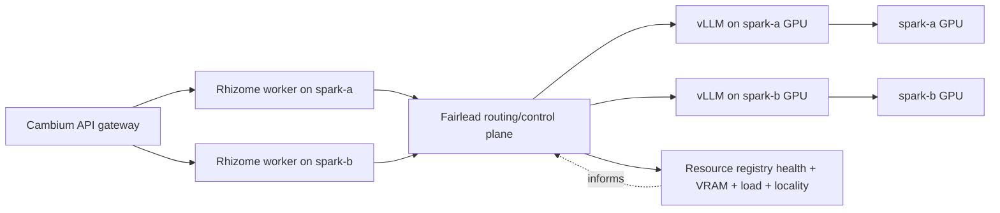

# Fairlead — Architecture and Implementation Guide

---

## The complete system

Five components, each owning a distinct layer:

```
User
  ↓  HTTPS
Verdant          React frontend — dashboard, chat, triage, tasks
  ↓  HTTPS /api/v1
Cambium          Go API gateway — auth, provider key management, SSE proxy
  ↓  HTTP /internal/agent (SSE)
Rhizome          Python LangGraph agent — 93 tools, planning, triage, DB
  ↓  HTTP /v1/chat/completions (OpenAI-compatible)
Fairlead         Rust compute router — inference routing, resource admission, circuit breaking
  ↓  HTTP /v1
vLLM             Python model server — GPU inference on spark-a
```

The current synchronous proxy surface routes OpenAI-compatible requests. The
current async surface supports worker-pull jobs: workers claim leased jobs,
renew leases, and report completion or failure. SQLite-backed durable job state
and terminal callbacks are implemented for single-process local deployments.
Future phases may add pool-aware placement, scheduler lifecycle hardening,
adapter boundaries, richer resource policy, cloud-provider fallback, and
transport/SDK hardening.

**Cambium** handles everything external-facing: verifies JWT tokens, decrypts the
user's stored API key, injects it into the Rhizome request. It knows about users
and sessions. It does not know about gardens.

**Rhizome** is the domain engine. It runs a LangGraph graph: session context →
weather → triage → LLM → tools → loop. It knows about plants, projects, tasks,
incidents. It does not know which GPU served its last LLM call.

**Fairlead** is a compute infrastructure layer. Today it receives
OpenAI-compatible synchronous requests and bounded async job submissions. It
knows about nodes, reported VRAM/load, circuit states, priority admission,
in-memory job queues, worker leases, and worker capacity. It does not know what
a garden is.

**vLLM** serves the model. It knows about GPU memory, batching, and
PagedAttention. It knows nothing above itself.

---

## Mental model: vLLM vs Fairlead

Fairlead is not an inference runtime. It does not load model weights, run CUDA
kernels, implement attention, tokenize prompts, or produce tokens directly. It is
the request gateway and control-plane layer in front of inference runtimes.

vLLM is the data-plane inference server. A vLLM process owns:

- Loading model weights into GPU memory.
- Tokenization and request execution.
- KV cache management.
- Continuous batching.
- GPU kernel execution through CUDA/PyTorch.
- Streaming OpenAI-compatible responses.
- Tensor parallelism when configured.

Fairlead owns routing and operational policy around those inference servers. It
can decide:

- Which backend URL should receive a request.
- Whether a backend should be skipped because its circuit is open.
- Whether a thread should prefer the same backend for cache locality.
- Whether a request should be rejected, retried, or routed elsewhere.
- What metrics and traces should describe the routing decision.

That means Fairlead is a control-plane gateway, while vLLM is the model-serving
data plane:

```text
client or agent
  -> Fairlead decides where work should go
  -> vLLM runs the model on GPU
  -> Fairlead streams the response back
```

### GPU resource management

Fairlead does not manage GPU memory at the CUDA allocator level. vLLM and other
GPU workers manage their own memory internally. Fairlead's role is admission
control: decide where work is allowed to go based on reported capacity, health,
priority, and current load.

There are three separate layers:

| Layer | Owner | Example responsibility |
|---|---|---|
| GPU execution | vLLM / CUDA / PyTorch | Load weights, allocate KV cache, run kernels |
| Process placement | k3s / Docker / systemd | Start, stop, restart, and place containers |
| Request admission | Fairlead | Pick backend, skip unhealthy nodes, avoid oversubscribed resources |

The current VRAM/load accounting model is cooperative. GPU consumers report
their resource use to Fairlead, and Fairlead uses that control-plane view to
avoid sending new work to nodes without enough reported headroom.

Example:

```text
node: spark-a
  total_vram_mb: 24576
  registered_consumers:
    - vllm-llama: 18432 MB
    - vision-worker: 6144 MB
  schedulable_headroom: 0 MB
```

Fairlead does not infer this from CUDA directly in the current design. It relies
on workers and model servers reporting capacity, or on future node probes that
publish capacity into Fairlead's registry. This is why the resource registry is a
scheduler input, not the source of truth for GPU execution.

The current code implements the synchronous gateway path: backend selection,
circuit breaking, health probing, soft affinity, streaming proxying, resource
reporting, resource-aware backend eligibility, priority admission, and basic
metrics. The async path implements in-memory job records, worker registration,
queue metrics, scheduler preview, worker-pull claims, lease renewal, result
reporting, retryable failure, worker capacity accounting, terminal duration
metrics, explicit timeout state for expired attempts, SQLite-backed job
recovery, and terminal callback delivery.

### Rhizome example: spark-a and spark-b

Assume a deployment with two GPU nodes:

- `spark-a`: runs a Rhizome worker and a local vLLM server.
- `spark-b`: runs a Rhizome worker and a local vLLM server.
- Fairlead can run as one shared service, or as a local sidecar per node. The
  routing policy is easiest to reason about as one logical Fairlead control
  plane.



The desired routing behavior is locality-aware and resource-aware:

```text
Rhizome request starts on spark-a
  -> prefer vLLM on spark-a, because same-node traffic should have lower latency
  -> if spark-a vLLM is unhealthy, overloaded, or lacks reported GPU headroom,
     route to spark-b vLLM
  -> if both local GPU backends are unavailable or full, return 503 today
     (future phases may queue or use cloud fallback)
```

The same applies in reverse for a Rhizome request that starts on spark-b:

```text
Rhizome request starts on spark-b
  -> prefer vLLM on spark-b
  -> if spark-b is unavailable or full, route to spark-a
  -> if both are unavailable or full, return 503 today
     (future phases may queue or use cloud fallback)
```

To make this work, Fairlead uses metadata that was added across the generalized
proxy and Trim work:

- **Backend node identity:** each backend must know whether it lives on `spark-a`,
  `spark-b`, or another node.
- **Request origin identity:** Rhizome or the local Fairlead sidecar must provide
  where the request originated, for example `X-Fairlead-Origin-Node: spark-a`.
- **Resource state:** vLLM and other GPU consumers must report usable capacity,
  reserved VRAM, current load, or an equivalent schedulable signal.
- **Workload metadata:** chat completions, embeddings, vision jobs, and batch
  jobs may have different resource estimates and priority rules.
- **Queue policy:** current synchronous requests fail fast by priority-admission
  limit; future background jobs can queue longer and yield to realtime work.

With those inputs, the router can make a decision like:

```text
candidates = all backends serving the requested model/workload
candidates = remove backends with open circuits
candidates = remove backends without enough reported capacity
prefer backend on request origin node
then prefer existing session affinity
then prefer lower load / higher free capacity
if none eligible:
  return 503 now; future phases may queue or fall back to cloud by workload policy
```

Current Fairlead implements locality-aware routing, ordered synchronous
backend-pool selection, async worker pool eligibility, and an opt-in
resource-aware slice. Backends and workers can carry `node_id` and `pool`
metadata, requests can carry `X-Fairlead-Origin-Node`, and workers/backends can
report resource state through `/v1/resources/report`. When
`RESOURCE_AWARE_ROUTING=true`, the synchronous router skips backends without a
fresh report that satisfies the workload's coarse VRAM estimate, applies pool
policy, locality, and affinity precedence, then ranks remaining eligible
candidates by lower reported load, higher available VRAM, and configured order
inside the selected pool stage. Async worker-pull claims emit per-pool placement
metrics for selected workers, compatible worker counts, and jobs skipped because
the claiming worker's pool was not allowed. Fairlead does not yet implement
durable starvation policy beyond current queue ordering or cloud fallback.

### Pool Policy Model

Phase 7 introduces pools as named placement boundaries shared by synchronous
backends and async workers. A pool is not a scheduler by itself; it is a policy
label such as `local-llm`, `peer-llm`, `vision`, or future `cloud-overflow`.
Workloads then declare which pools they are allowed to use.

Phase 7A adds the configuration and validation layer:

```bash
POOLS_JSON='["local-llm", "peer-llm", {"id": "vision"}]'
WORKLOAD_POOLS_JSON='{
  "chat_completions": ["local-llm", "peer-llm"],
  "embeddings": ["local-llm", "peer-llm"],
  "vision_analysis": ["vision"]
}'
```

If `POOLS_JSON` is absent, Fairlead derives pools from backend metadata and
always includes `default` for backward compatibility with simple `BACKENDS`
configuration. If `WORKLOAD_POOLS_JSON` is absent, Fairlead creates a permissive
default policy where every known workload can use every configured pool. Startup
validation rejects empty pool IDs, duplicate pool IDs, backends that reference
undeclared pools, unknown workload names, empty workload pool lists, duplicate
pool references, and workload policies that reference undeclared pools.

Phase 7B applies this validated policy to synchronous backend selection. A
backend is eligible for chat or embeddings only when it supports the requested
workload and its pool is allowed by that workload's policy. If an explicit
policy omits a workload, that workload remains permissive by default. If every
backend is outside the workload's allowed pools, Fairlead returns `503` without
contacting an upstream backend.

Phase 7D adds optional strict workload pool validation. With the default
permissive setting, explicit `WORKLOAD_POOLS_JSON` can be a partial override.
With `STRICT_WORKLOAD_POOLS=true`, Fairlead fails startup unless
`WORKLOAD_POOLS_JSON` is present and mentions every known workload. This makes
production-like deployments fail fast when a workload was accidentally omitted,
while local development can keep using incremental pool policy.

For synchronous routing, the workload's pool list is ordered. Fairlead tries the
first pool's eligible backends, then falls back to the next pool only when no
backend in the earlier pool can be selected. Within each pool, the existing
selection rules still apply: origin locality, session affinity, resource
ranking, circuit state, and configured backend order choose the concrete
backend. Phase 7C applies the same vocabulary to async worker placement through
worker pool metadata and workload pool policy checks during preview and
worker-pull claims.

Synchronous pool routing emits Prometheus counters for each pool stage Fairlead
evaluates:

- `fairlead_pool_selections_total`
- `fairlead_pool_candidate_backends_total`
- `fairlead_pool_resource_ineligible_backends_total`

These metrics expose selected or unavailable pool stages, the selected
pool/backend when one exists, candidate backend counts, and resource pressure
inside each pool.

---

## What Fairlead does

Two distinct surfaces.

### Surface 1: Synchronous inference proxy

```
POST /v1/chat/completions   — receive, select backend, proxy, stream back
POST /v1/embeddings         — same pattern for embedding requests
GET /v1/models              — list configured backend/model metadata
```

Every inference request goes through a decision pipeline:

```
request arrives
  → check priority (realtime / batch / background)
  → acquire a synchronous admission slot for that priority, or return 429
  → find eligible backends (workload support + allowed pool + circuit/resource state)
  → prefer origin node
  → check session affinity
  → proxy to selected backend, stream response back
  → if backend fails: try next in fallback chain
  → if all eligible backends fail: return 502/503
```

### Surface 2: Async job dispatch

Phase 6B implements the HTTP job surface, worker registration, queue visibility,
and scheduler preview with in-memory state. Phase 6C adds the first worker-pull
claim path: Fairlead grants a bounded lease, marks the job running, and returns
it to the worker. Phase 6D adds worker completion/failure, retryable requeue,
worker capacity accounting, duration metrics, and explicit timeout state for
expired attempts. Fairlead also opportunistically requeues expired running
leases before fresh workers claim more work. Later Phase 6 slices add opt-in
SQLite persistence and bounded terminal callback delivery. Phase 8A adds worker
lifecycle controls. The design belongs in the architecture because it defines
Fairlead's boundary: Fairlead should be a compute control plane, not a
general-purpose workflow engine.

```
POST /v1/jobs        — submit, get job_id immediately
GET  /v1/jobs        — list in-memory job records
POST /v1/jobs/prune  — remove eligible terminal jobs by retention policy
GET  /v1/jobs/{id}   — poll status
DELETE /v1/jobs/{id} — cancel queued or running work when supported
GET  /v1/scheduler/preview    — preview next job/worker match without mutation
POST /v1/workers/register       — register or update worker capabilities
POST /v1/workers/{id}/heartbeat — refresh worker liveness
POST /v1/workers/{id}/drain     — stop assigning new jobs to a worker
POST /v1/workers/{id}/reactivate — let a drained worker accept new jobs again
DELETE /v1/workers/{id}         — remove idle workers or drain busy workers
POST /v1/workers/{id}/claim     — lease a compatible queued job to a worker
POST /v1/workers/{worker_id}/jobs/{job_id}/renew — renew a held lease
POST /v1/workers/{worker_id}/jobs/{job_id}/complete — complete a held job
POST /v1/workers/{worker_id}/jobs/{job_id}/fail — fail or requeue a held job
GET  /v1/workers                — list registered workers
```

Current async scheduler behavior:

- submitted jobs enter `queued`
- `POST /v1/jobs` accepts an optional `idempotency_key`; a retry with the same
  key and same request body returns the original job instead of enqueueing a
  duplicate, while reusing the key for a different request is rejected
- submitted jobs are tracked in in-memory per-priority queues
- `GET /v1/jobs` lists current in-memory job records
- `/metrics` exposes `fairlead_job_queue_depth{priority,type}`
- `/metrics` exposes `fairlead_job_queue_wait_seconds_sum{priority,type}` and
  `fairlead_job_queue_wait_seconds_max{priority,type}`
- `/metrics` exposes terminal async job duration through
  `fairlead_job_duration_seconds_count{priority,type,status}`,
  `fairlead_job_duration_seconds_sum{priority,type,status}`, and
  `fairlead_job_duration_seconds_max{priority,type,status}`
- job state is in memory by default; opt-in SQLite state persists jobs, queue
  order, submit idempotency keys, leases, terminal worker-attempt metadata,
  terminal state, callback metadata, and callback delivery state across ordinary
  Fairlead restarts
- cancellation marks queued jobs `cancelled`
- cancellation removes queued jobs from queue depth and wait-time accounting
- repeated cancellation returns the existing job when it is already `cancelled`;
  cancellation still returns conflict for jobs that already completed or failed
- registered workers are listed with stale and draining status
- workers can be drained, reactivated, or deregistered
- draining workers remain registered but are skipped by scheduler preview and
  worker-pull claims for new work
- busy deregistration marks the worker draining and returns `202 Accepted` so
  held leases can renew, complete, or fail; idle deregistration removes the
  worker immediately
- `/metrics` exposes `fairlead_workers{type,status}`
- worker snapshots track `in_flight_jobs`, optional `max_concurrent_jobs`, and
  optional `available_job_slots`
- `/metrics` exposes `fairlead_worker_in_flight_jobs{worker,node}`,
  `fairlead_worker_max_concurrent_jobs{worker,node}`, and
  `fairlead_worker_available_job_slots{worker,node}`
- `GET /v1/scheduler/preview` selects the next queued job and fresh compatible
  worker without changing job state
- `POST /v1/workers/{id}/claim` validates the worker, grants a lease for a
  compatible queued job only if the worker has capacity, marks it `running`,
  increments worker in-flight accounting, and removes it from queue metrics
- worker claims first sweep expired leases: expired jobs reenter their priority
  queue if attempts remain, otherwise they become `failed`; expired leases also
  release the previous worker's in-flight slot and record `attempt timed out` in
  the job error field
- `POST /v1/workers/{worker_id}/jobs/{job_id}/renew` validates the worker,
  sweeps expired leases, and extends the lease only if that worker still holds
  the running job
- `POST /v1/workers/{worker_id}/jobs/{job_id}/complete` validates the worker
  and lease, then marks the job `complete` with a result payload and releases
  worker capacity
- `POST /v1/workers/{worker_id}/jobs/{job_id}/fail` validates the worker and
  lease, records an error, then requeues retryable failures when attempts remain
  or marks the job `failed`; both paths release worker capacity
- worker complete/fail requests may include the lease `attempt`; exact duplicate
  terminal reports with the same worker, attempt, and payload return the
  existing terminal job without releasing worker capacity or dispatching another
  callback, while contradictory terminal reports still return conflict
- no push dispatch exists yet; workers must pull by calling the claim endpoint
- terminal jobs with `callback_url` dispatch asynchronous callbacks with bounded
  retry and timeout policy
- callback dispatch deduplicates in-flight delivery by job ID and skips
  delivered callbacks; SQLite-backed callback state gives at-least-once
  delivery across ordinary Fairlead restarts by retrying pending callbacks after
  startup
- `POST /v1/jobs/prune` removes terminal jobs older than the configured
  retention age, up to the configured per-call limit
- pruning skips terminal jobs with pending callbacks so callback delivery can
  continue
- pruning removes submit idempotency-key mappings for removed jobs, allowing a
  key to be reused after the retained job record is gone
- pruning persists to SQLite when `JOB_STORE=sqlite` is enabled
- `/metrics` exposes `fairlead_job_prunes_total{status}`
- a background lease recovery loop periodically applies the same expired-lease
  sweep used by worker claims, so timed-out jobs can requeue or fail without
  waiting for another worker request
- background terminal-job pruning is still deferred; operators use
  `POST /v1/jobs/prune` explicitly for now

Current worker-pull execution flow:

```
job submitted
  → queued by priority (realtime > batch > background)
  → scheduler selects a registered worker with matching job type + VRAM headroom
  → Fairlead records a bounded lease for the running attempt
  → worker processes async
  → worker completes or renews the job lease before it expires
  → Fairlead records completion/failure and releases worker capacity
  → if the lease expires first, claim-time sweeps or the background maintenance
    loop record timeout error state and requeue or fail the job by remaining
    attempts
  → terminal callback state is persisted when callback_url exists
  → Fairlead posts the terminal job payload to the callback_url until a 2xx
    response is recorded
```

**Job types:**
- `vision_analysis` — route to vision MCP sidecar on spark-a GPU
- `embed_batch` — batch embedding generation
- `index_build` — pgvector or FAISS index construction
- `cluster` — k-means or HDBSCAN over an embedding space

**Supporting infrastructure:**
- `POST /v1/workers/register` — workers announce capabilities, endpoint, node
  metadata, and pool metadata
- `POST /v1/workers/{id}/heartbeat` — workers refresh liveness
- `POST /v1/workers/{id}/drain` — workers remain registered but stop receiving
  new claims
- `POST /v1/workers/{id}/reactivate` — drained workers can receive new claims
  again
- `DELETE /v1/workers/{id}` — idle workers are removed; busy workers are marked
  draining so held leases can finish
- `GET /v1/workers` — current in-memory worker registry
- `POST /v1/workers/{id}/claim` — worker-pull claim endpoint
- `POST /v1/workers/{worker_id}/jobs/{job_id}/renew` — lease renewal
- `POST /v1/workers/{worker_id}/jobs/{job_id}/complete` — completion
- `POST /v1/workers/{worker_id}/jobs/{job_id}/fail` — failure/retry
- `POST /v1/jobs/prune` — explicit terminal-job pruning
- `POST /v1/resources/report` — GPU consumers and workers report capacity
- `GET /v1/resources` — current resource control-plane state
- `GET /metrics` — Prometheus: queue depth/wait, circuit states, VRAM per node,
  worker availability, worker in-flight capacity, async worker pool placement,
  job duration, callback delivery outcomes, and terminal job pruning
- Persistent callback-attempt state and pending callback recovery are
  implemented for SQLite-backed job state.
- Background pruning remains deferred to Phase 8D; Phase 8B pruning is explicit.

### Worker-pull claim decision

Phase 6C uses a worker-scoped claim endpoint:

```text
POST /v1/workers/{id}/claim
```

This is a worker-pull API shape, but it does not make workers the scheduler.
Workers only announce readiness by asking for work. Fairlead remains the central
controller: it validates the worker, checks freshness and capabilities, scans
queued jobs by priority/FIFO order, applies lease/resource policy, and either
returns a leased job or returns no work.

Phase 7C applies workload pool policy to this worker-pull path. Worker
registration now includes a `pool` field, defaulting to `default` for older
clients. Scheduler preview and worker claims only match a queued job when the
worker supports the job type and the workload policy allows the worker's pool.
If a worker asks for work but every queued job is outside that worker's allowed
pool, Fairlead releases the worker slot and returns `204 No Content`.

Phase 7D adds optional strict worker pool registration. By default, Fairlead
allows any non-empty worker pool string, which keeps dynamic local workers and
experiments flexible. When `STRICT_WORKER_POOLS=true`, registration fails unless
the worker's pool appears in configured or derived `POOLS_JSON`. This catches
pool-name typos and bounds metric labels in production-like deployments without
making strict mode the migration default.

The claim path emits async pool placement counters:

- `fairlead_async_pool_selections_total`
- `fairlead_async_pool_candidate_workers_total`
- `fairlead_async_pool_no_compatible_jobs_total`

The alternative would be a job-scoped claim endpoint such as:

```text
POST /v1/jobs/claim
{ "worker_id": "vision-a" }
```

That can work, but it treats claiming as a generic queue operation and pushes
worker authority into the request body. The worker-scoped route makes the actor
explicit and keeps the lifecycle clear:

```text
register -> heartbeat -> claim -> execute -> complete/fail
```

This choice has useful downstream consequences:

- Worker identity, freshness, auth, and draining all attach naturally to the
  route.
- Fairlead can enforce that only the worker holding a lease may renew,
  complete, or fail that job.
- Worker utilization metrics can count claims and in-flight leases per worker.
- Backpressure remains simple: a worker asks only when ready, while Fairlead
  still controls assignment.
- Workers do not need to expose externally reachable HTTP dispatch endpoints for
  Fairlead to push jobs.

The internal implementation may still live in scheduler/job modules and must
mutate job state atomically. The route shape describes the actor; it does not
weaken Fairlead's central scheduling authority.

### Future gRPC transport

Fairlead currently exposes HTTP/JSON APIs and forwards synchronous LLM requests
to OpenAI-compatible HTTP backends such as vLLM. That should remain the default
compatibility surface because it works with existing OpenAI clients, vLLM, demos,
and simple service-to-service calls.

gRPC can still be useful later as an optional transport layer once the job and
worker contracts stabilize. The important split is:

- inbound client transport: Rhizome or another caller talks to Fairlead
- scheduling core: Fairlead validates, queues, leases, retries, and records jobs
- outbound backend adapter: Fairlead talks to vLLM, a vision worker, or another
  compute service

Possible later shapes:

```text
Rhizome --gRPC--> Fairlead --HTTP/OpenAI--> vLLM
worker  --gRPC--> Fairlead claim/heartbeat/complete APIs
Fairlead --gRPC--> worker service, if that worker exposes typed RPCs
```

This is not Phase 6C scope. Adding gRPC well means defining protobuf contracts,
generating Rust/Python clients, testing HTTP/gRPC parity, deciding streaming
semantics, and preserving OpenAI-compatible HTTP behavior for LLM endpoints.
It fits better in Phase 9 adapter work or Phase 12 transport/SDK hardening.

### Scheduler boundaries

The scheduler exists because Fairlead can run for days, weeks, or indefinitely
as a service while individual compute jobs should stay bounded. If an
image-processing job runs longer than a few minutes, that is probably an
execution failure, not a normal workflow that needs durable multi-day
orchestration.

Layer ownership should stay split this way:

```text
k3s / Docker:
  run containers
  restart crashed services
  expose services
  apply node labels and GPU placement constraints

Fairlead:
  accept compute jobs
  queue by priority
  select workers/backends by health, node, workload, and resources
  track job attempts
  enforce timeouts and leases
  retry failed compute attempts
  expose job status
  deliver callbacks

Rhizome:
  own garden/user/domain state
  create VisionJob records
  interpret model results
  create incidents, interactions, and user-visible records
  reconcile pending domain work

Temporal, if added later:
  durable multi-step workflow orchestration
  long waits
  fanout/fanin
  cross-service retries and compensation
  recovery of product workflows after crashes
```

Fairlead should know where compute can run. It should not know what a plant
diagnosis means or which user-facing record should be created.

### Scheduler state model

The Fairlead scheduler should treat jobs as bounded state machines:

```text
pending
  -> leased/running
  -> succeeded
  -> failed
  -> cancelled
```

Failure paths:

```text
leased/running
  -> timed_out -> retry_pending or failed
  -> worker_lost -> retry_pending or failed
  -> cancelled
```

The key mechanism is a lease. When a worker starts a job, Fairlead records the
worker ID and a `lease_expires_at` timestamp. The worker must complete the job
or renew that job lease before it expires. If it does not, Fairlead releases any
resource reservation and either retries the job on another worker or marks it
failed. This is separate from worker heartbeat, which only proves worker
liveness. Job renewal proves that the leased attempt is still making progress.
This avoids holding an open process relationship for days; Fairlead only stores
job state and watches bounded leases.

The first useful workload is `vision_analysis`: a user-triggered image workflow
that should outrank background indexing but yield to realtime chat or retrieval.

### Scheduler persistence

An in-memory queue is acceptable for a prototype demo, but production-like
Fairlead should persist job state. The scheduler mostly needs durable state
transitions, not a massive distributed datastore.

Core records look relational:

```text
job_id
status
priority
workload_kind
worker_id
attempt_count
lease_expires_at
created_at
updated_at
input_ref
result_ref
error
callback_url
callback_status
callback_attempt_count
callback_last_attempt_at
callback_delivered_at
callback_last_http_status
callback_last_error
```

Common scheduler operations must be atomic:

```text
claim the oldest pending high-priority job
mark it running
increment attempt_count
set lease_expires_at
reserve resources
```

Recommended persistence path:

- **SQLite first:** good for a local appliance, single Fairlead process, demos,
  and portfolio deployment. It is durable, inspectable, transactional, and does
  not require another service. Phase 6E keeps `JOB_STORE=memory` as the default
  and adds `JOB_STORE=sqlite` as an opt-in durable path for job records, queue
  order, leases, attempts, result/error state, and terminal state.
- **Postgres later:** better when multiple Fairlead instances need to coordinate
  safely. Row locking and transactions map well to job claiming and leases.
- **Redis optionally:** useful for fast queues, pub/sub, rate limits, or caches,
  but less ideal as the canonical job history and recovery database.
- **NATS JetStream or RabbitMQ optionally:** useful when broker semantics become
  more important than direct SQL-backed job state.
- **Kafka/Redpanda:** useful for high-throughput event logs and replay, likely
  overkill for Fairlead's early scheduler.
- **Cassandra:** not a good fit unless Fairlead becomes a massive distributed
  event store. It makes ordering, leases, transactions, and debugging harder than
  this project needs.

### When Temporal becomes worth it

Temporal is useful if Rhizome workflows become more complex than bounded compute
jobs. Signs that Temporal is justified:

- Steps wait for hours or days.
- A workflow fans out to many workers and collects partial results.
- Only failed branches should retry.
- Multiple services must be updated with compensation logic.
- Cancellations can happen halfway through a multi-step workflow.
- Recovery after service restart would otherwise require rebuilding a workflow
  engine inside Rhizome or Fairlead.

Until then, Fairlead should provide compute job orchestration, and Rhizome should
own the domain-level VisionJob state machine.

---

## Priority Admission Now, Priority Queues Later

The core scheduling guarantee:

| Priority | Who uses it | What it means |
|---|---|---|
| `realtime` | Chat completions, query-time embeddings | A user is waiting. Schedule first, always. |
| `batch` | Vision jobs, async embeddings | User submitted and moved on. Schedule when no realtime demand. |
| `background` | Index builds, clustering, KB ingestion | No user waiting. Only run when the GPU has nothing more important to do. |

The long-term goal is that a background index rebuild that started at midnight
will not slow down a user's chat response at 9am. That will be enforced
structurally by the future scheduler, not by application policy.

Current Fairlead parses `X-Fairlead-Priority` on synchronous requests, defaults
missing priority to `realtime`, rejects unknown values with `400`, enforces
per-priority in-flight admission limits, and exposes priority on routing
metrics.

This is not yet a durable priority queue. A full synchronous bucket fails fast
with `429 Too Many Requests`; Fairlead does not currently wait in a queue for
capacity. The async job API exposes in-memory queue depth and wait age, but
durable starvation policy and richer async scheduling remain future scheduler
work.

---

## Phased Build Plan

| Phase | What you build | What it unlocks |
|---|---|---|
| 1 | Axum server, /health, config, tracing | Something that runs |
| 2 | OpenAI proxy, single backend, streaming | Rhizome can call Fairlead instead of cloud |
| 3 | Circuit breaker, health checks, basic /metrics | Automatic failover when vLLM crashes |
| 4 | Fallback chain, session affinity, same-request retry | Local resilience across configured backends |
| 5 | Resource registry, VRAM accounting, priority admission | Synchronous inference avoids oversubscribed local GPUs and fails fast by priority |
| 6A | Synchronous surface cleanup: workload metadata, pool metadata, header policy, `/v1/models` | More synchronous workloads can share the proxy cleanly |
| 6B | Async job API, queue visibility, worker registration, scheduler preview | Fairlead can describe async work and select a compatible worker without dispatching |
| 6C | Worker-pull claims and leases | Workers can safely claim bounded jobs without duplicate execution |
| 6D | Worker execution, retries, and utilization | Leased jobs can complete/fail with bounded attempts and useful metrics |
| 6E | Durable job state and recovery | Queued/running async work survives ordinary Fairlead restarts |
| 6F | Callback delivery and async finalization | Callers can receive terminal job updates without polling forever |
| 7 | Pool-aware placement | Workloads can target named local, peer, or future overflow pools consistently |
| 8 | Scheduler hardening | Async workers can drain, deregister, prune completed jobs, and survive process-level restart tests |
| 9 | Adapter boundaries and new workloads | Non-OpenAI-compatible workloads can plug into Fairlead without polluting router core |
| 10 | Rich resource policy | Scheduling can account for CPU slots, GPU slots, model residency, and custom capacity |
| 11 | External scale and overflow | Multiple Fairlead instances and optional cloud overflow can be evaluated with explicit policy |
| 12 | Transport and SDK hardening | Stable clients and optional gRPC can be added after HTTP contracts settle |

Phases 1–3 give you a working proxy in a few days. Phases 4–5 give you
production resilience. Phase 6 completes the core sync/async control-plane
surfaces. Phase 7 completes pool-aware placement across synchronous backends and
async workers. Later phases harden the scheduler, add adapters, improve
resource policy, evaluate scale/overflow, and only then add optional transport
or SDK layers.

Temporal is intentionally deferred. Fairlead's scheduler should handle bounded
compute jobs with leases, retries, cancellation, callbacks, and recoverable job
state. Temporal becomes useful later only if Rhizome needs durable multi-step
business workflows with long waits, fanout/fanin, or compensation logic.

---

## How Rust defines the architecture

Rust's design forces certain architectural decisions that you can't avoid — but
they are the right decisions. Understanding them before writing the first line
prevents a lot of friction.

### 1. Ownership drives shared state design

In Python you write:
```python
backends = {}  # anyone can read/write
```

Rust won't compile that across threads. Every piece of shared mutable state must
be explicit:
```rust
// Arc = shared ownership across threads
// RwLock = many readers OR one writer at a time
type BackendMap = Arc<RwLock<HashMap<String, BackendState>>>;
```

This isn't ceremony — it's the architecture. When you write `Arc<RwLock<...>>`
you're making a deliberate decision: "this data will be read by many concurrent
request handlers and occasionally written by background health check tasks."
The type encodes the concurrency pattern.

Fairlead's shared state objects, each `Arc`-wrapped and cloned into each handler
and background task:
- `Arc<RwLock<BackendMap>>` — backend states and circuit breakers
- `Arc<RwLock<ResourceRegistry>>` — cooperative resource reports per node/backend
- `Arc<RwLock<AffinityMap>>` — workload-scoped thread ID → preferred backend
- `WorkerRegistry` wrapping `Arc<RwLock<...>>` — registered job workers

### 2. The async model requires structure, not just `async fn`

Tokio is cooperative multitasking. A task runs until it hits an `.await` point,
then yields. Blocking work between `.await` points — a long computation, a
`std::thread::sleep`, synchronous file I/O — freezes the entire thread, which in
Tokio may be serving hundreds of concurrent requests.

This forces a clear architecture split.

**Async path** — request handlers, forwarding, queue checks:
```rust
async fn handle_chat_completions(/* ... */) -> Response {
    let backend = router
        .select_backend_excluding_resource(&attempted, &resource_state)
        .await;                                    // async: checks circuit state
    let response = client.post(&backend.url)
        .send().await?;                            // async: network I/O
    Body::from_stream(response.bytes_stream())     // async: stream back
}
```

**Background tasks** — health checks, job scheduler, metrics:
```rust
// Spawned once at startup, run forever
tokio::spawn(async move {
    let mut interval = tokio::time::interval(Duration::from_secs(10));
    loop {
        interval.tick().await;
        probe_backend(&url, &circuit).await;
    }
});
```

The server will have a handful of long-lived background tasks (one per backend
for health checking, one for the job scheduler) and thousands of short-lived
request handler tasks. They all share the `Arc`-wrapped state through clones.

### 3. The type system makes state machines correct

The circuit breaker has three states. In Python you'd use a string. In Rust:

```rust
enum CircuitState {
    Closed,
    Open { until: std::time::Instant },
    HalfOpen,
}
```

Every `match` on this enum must handle all three cases. The compiler will not let
you forget `HalfOpen`. This matters for a circuit breaker because the half-open
state (one probe request to test recovery) is the subtle one — it's exactly what
you'd accidentally skip in a string-based approach.

The same applies to job status, backend health, and priority levels. Everything
with a finite set of states becomes an enum. Exhaustiveness is enforced.

### 4. Future queues use channels instead of shared queue locks

The future async job scheduler should use Tokio channels — one per priority
level — rather than a shared queue data structure with a lock:

```rust
let (realtime_tx, mut realtime_rx) = mpsc::channel::<Job>(256);
let (batch_tx,    mut batch_rx)    = mpsc::channel::<Job>(256);
let (bg_tx,       mut bg_rx)       = mpsc::channel::<Job>(256);
```

The `biased` `select!` enforces priority:
```rust
loop {
    tokio::select! {
        biased;   // evaluate branches in declared order, not randomly
        Some(job) = realtime_rx.recv() => dispatch(job).await,
        Some(job) = batch_rx.recv(),
            if realtime_rx.is_empty() => dispatch(job).await,
        Some(job) = bg_rx.recv(),
            if realtime_rx.is_empty() && batch_rx.is_empty() => dispatch(job).await,
    }
}
```

Without `biased`, Tokio randomizes which ready branch is selected to prevent
starvation. With it, you get strict priority. The queue depth of each channel
is directly observable for Prometheus metrics.

### 5. Send + Sync are the concurrency contract

Rust's trait system expresses thread safety. Any value that needs to cross thread
boundaries must implement `Send`. Any value that can be safely shared by reference
across threads must implement `Sync`.

Tokio requires `Send + 'static` on everything spawned as a task. When you
`tokio::spawn` a health check task that closes over the backend state, Rust
verifies at compile time that the backend state is safe to send across threads.
If it isn't, you get a clear compile error — not a race condition at runtime
six months later.

`Arc<RwLock<T>>` is both `Send` and `Sync` when `T: Send + Sync`. The `Arc`
handles shared ownership; the `RwLock` handles mutation safety; the compiler
verifies the combination is sound.

### 6. Zero-cost abstractions mean the architecture mirrors performance

Rust's abstractions compile to the same machine code as hand-written code.
Generics (static dispatch) have zero overhead; `Box<dyn Trait>` (dynamic
dispatch) has a small indirection cost.

On the hot path (every inference request): use generics. The circuit breaker
check and VRAM query happen for every request — the compiler inlines them.

For the job dispatcher (not hot): trait objects are fine. The flexibility of
dispatching to different worker types at runtime matters more than the
nanoseconds.

---

## The mental model

Fairlead is a tree of async tasks sharing Arc-wrapped state through explicit
synchronized wrappers. A handful of long-lived background tasks — health
checkers, job scheduler, metrics collector — run forever alongside thousands
of short-lived request handler tasks. They communicate through channels, not
shared memory. The type system enforces that all state transitions are
exhaustive. The borrow checker enforces that nothing is mutated unsafely.
The async runtime ensures nothing blocks. The result is a system that is
concurrent by default, thread-safe by construction, and whose performance
characteristics are predictable because nothing is hiding behind a garbage
collector.
